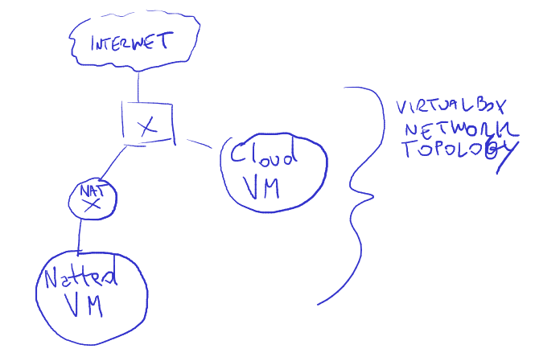

# This Repo contains the template to dockerize Ros2 Nodes and a zenoh router demo
I have dockerized the ros2 turtlesim example in order to test the zenoh router usefulness across NAT.
I have included the scripts to setup a communication across nat using the zenoh router.

# Knowledge required
You need to be familiar with the ros2 beginner tutorial (https://docs.ros.org/en/iron/Tutorials/Beginner-CLI-Tools/Introducing-Turtlesim/Introducing-Turtlesim.html) as this example is nothing more than porting it to work from one machine to two machines separated by a NAT.
You need to have a general idea of what zenoh bridge is and what it does.

# VMs Setup

You need to clone this repo into two different vms:
- Set the network for the "Cloud VM" in bridged mode.
- Set the network for the "Natted VM" in NAT mode

# Setup
1) Install docker in both vms
2) install the zenoh router: ./install-zenoh-router-setup.sh
3) build the two docker containers using the "Build Dockers" vscode task included in the repo(CTRL+Shift+P)
4) run the zenoh router in the cloudVM using the command "zenohd"
5) run the turtle_teleop_key container in the one VM:
    - docker run -it turtle_teleop_key:test
6) run the turtlesim container in the other vm:
    - docker run turtlesim-headless:test
    - NOTE: the container runs in headless mode, so no gui will be shown, you can test it is working by looking at the warning messages it creates when the turtle goes out of the playing area (the "clamping" messages).
7) run this commands on both vms to start the zenoh-bridge-dss containers and connect them to the router:
    - on CloudVM: docker run --init --net host eclipse/zenoh-bridge-dds -e tcp/<CLOUDVM-IP>:7447
    - on NattedVM: docker run --init --net host eclipse/zenoh-bridge-dds -e tcp/:7447

# Things that have not been done yet
1) containerizing the zenoh router
2) porting everything into kubernetes, at least on the cloudVM side
